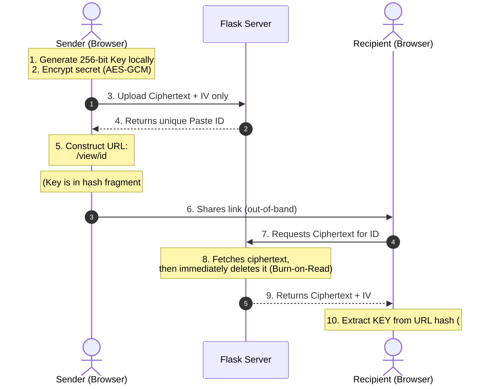

# PasteSafe - Zero-Knowledge Secure Paste Portal 🗝️🔥

A secure, zero-knowledge secret-sharing web portal. It allows users to share passwords, credentials, configuration details, or sensitive notes via self-destructing, one-time viewing links. 

It implements client-side **AES-256-GCM** encryption using the browser's native Web Crypto API. The server only handles encrypted payloads and remains completely blind to the plaintext.

---

## 🔒 The Zero-Knowledge Hash Anchor Model
Standard web servers have visibility into the files and strings sent to them. PasteSafe prevents this by utilizing client-side encryption and URL hash anchors (`#`):



### Why this is secure:
- **Zero Key Leakage:** The decryption key is appended to the URL after the hash fragment (`#`). According to standard browser and HTTP protocol rules, hash fragments are parsed entirely client-side and **never** sent to the server in the HTTP request header.
- **One-Time Burn:** As soon as a paste is queried once, the server completely deletes the row from the SQLite database.
- **Automatic Expiration Sweep:** A background thread running on the server deletes expired pastes every 60 seconds, ensuring old unread secrets don't linger.

---

## 🛠️ Features
- **Client-Side Cryptography:** Encrypts secrets using **AES-256-GCM** via the browser's native `window.crypto.subtle` API.
- **Stealth One-Time Views:** Deletes secrets immediately upon first retrieval (burn-on-read).
- **Auto-Expiry Cleanup:** Allows users to choose custom time-to-live settings (5 mins, 1 hour, 1 day) backed by a server-side cleanup sweep daemon.
- **Lightweight Backend:** Built with pure Python/Flask and SQLite with zero server-side cryptographic dependencies.
- **Vibrant Glassmorphic UI:** Beautiful dark-mode dashboard for creating pastes and securely reading them.

---

## 🚀 Quick Start

### 1. Installation
Clone the repository and set up a virtual environment:
```bash
# Navigate to pastesafe folder
cd pastesafe

# Create and activate virtual environment
python -m venv .venv
source .venv/bin/activate  # On Windows: .venv\Scripts\activate

# Install dependencies
pip install -r requirements.txt
```

### 2. Run the Portal Server
Start the Flask application (runs on port `5003` to avoid conflicts):
```bash
python server.py
```

### 3. Open the Web App
Open your browser and navigate to:
👉 [http://localhost:5003](http://localhost:5003)

---

## 🧪 Testing the Setup

### Automated Tests
Execute the unit test suite checking storage boundaries, burn triggers, and timeouts:
```bash
python -m unittest discover -s tests
```

### Manual Verification
1. Open [http://localhost:5003](http://localhost:5003).
2. Enter your secret (e.g. `secret-database-credentials`), select an expiry time, and click **Encrypt & Share**.
3. Copy the generated secure link. Note that it contains a hash anchor `#<key>`.
4. Open the link in a different browser window (e.g., Incognito).
5. Click **Reveal Secret** to decrypt and view the plaintext.
6. Refresh the page or try to access the link again. Verify that the server returns a "Secret Not Found" page, proving it has been burned.

---

## 📁 Repository Layout
- `templates/`
  - `index.html` - Premium HTML/JS page holding GCM encrypters/decrypters and view switches.
- `server.py` - Flask server API, SQLite initializer, and background cleaner daemon.
- `requirements.txt` - Python module dependencies.
- `tests/` - Unit tests directory.
